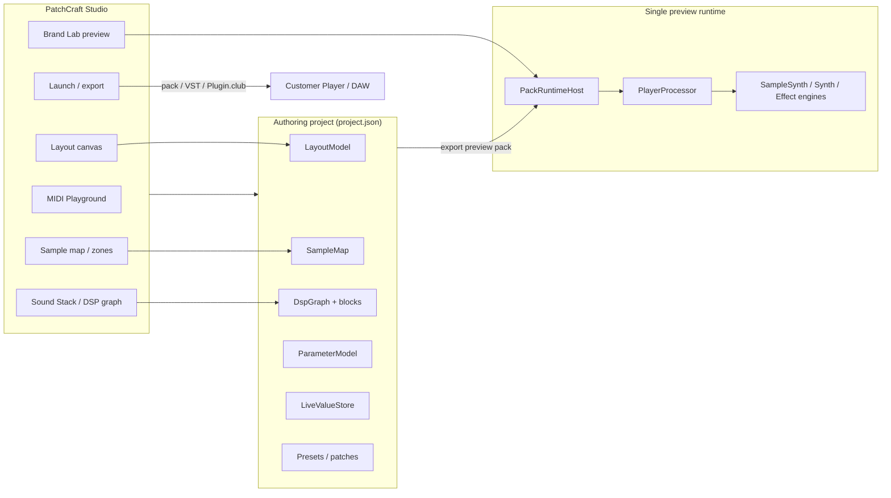

# PatchCraft — Product Overview, Features, and Author Flow

**Purpose:** One reference for what PatchCraft is, what it does, how the pieces connect, and where the user flow breaks today. Use this to align UX, fix wiring bugs, and prioritize ship work.

**Last updated:** 2026-06-25 (reflects RF spine + Chop Lab work in progress)

---

## What PatchCraft Is

PatchCraft is an **instrument authoring system** for building sample instruments, synths, drum machines, and FX plugins, then shipping them as:

| Deliverable | What the buyer gets |
|-------------|---------------------|
| **PatchCraft Pack** (`.patchcraft` / folder) | Branded layout + sound + presets, loaded by PatchCraft Player |
| **PatchCraft Player** (standalone + VST3) | Customer-facing instrument shell (Rack, Mixer, Snapshots, Sound DNA, MIDI Learn, import) |
| **PatchCraft Player FX** (VST3) | Effect plugin using the same layout/runtime model |
| **Branded VST3** (paid VST Expansion) | Standalone exported plugin product (separate from base Player) |
| **Plugin.club publish payload** | Marketplace draft with metadata, artwork, licensing fields |

**PatchCraft Studio** is the desktop authoring app (Windows primary; macOS port exists). Authors design UI on a canvas, map controls to parameters, build/sample the sound engine, preview through the same runtime customers use, and export.

**Core promise:** *Simple instruments in minutes; complex ones without a CS degree.* Factory demos prove a **3-block Simple Stack** (Source → Tone → Space) is enough for most shippable products. Advanced graph, motion, MIDI Playground, and pScript are optional power layers.

**Company / runtime:** AudiCode. Licensing today: Plugin.club device auth; AudiLock planned as source of truth (`docs/AUDILOCK_LICENSING_PLAN.md`).

---

## System Architecture (Author → Runtime)



**Key rule:** There is **one** customer runtime (`PackRuntimeHost` → `PlayerProcessor`). Brand tab preview, toolbar **Preview/Listen**, and (when working) Stack **Listen** should all hear the **same** exported pack state—not separate ad-hoc engines.

**Exception (intentional but confusing):** Some Studio panels use **local audition engines** (Sample Mapper audition, Chop Lab pad preview). Those must either sync back to the project model on Apply, or clearly label themselves as “local preview only.”

---

## The Author Flow (RF Spine)

PatchCraftRF unified Studio around a **Layout-first spine**. Primary canvas toolbar tabs:

| Tab | Bottom panel page | Author job |
|-----|-------------------|------------|
| **Layout** | Design | Canvas size, elements, control bindings, presets strip |
| **Sound** | Samples | Import/map samples, keyzones, velocity, health checks |
| **Chop** | Chop | Serato-style slice one WAV into up to 32 cue-point pads (new) |
| **Stack** | DSP | Sound Stack: Source, Tone, Space, optional Motion blocks |
| **Perform** | MidiPlayground | Steps, piano roll, drum grid, MIDI templates |
| **Brand** | Branding | Logo, colors, title bar; **live Player chrome preview** |
| **Ship** | Export | Launch Center, readiness checks, pack/VST export |

**Secondary entry points** (Window → Advanced): Dashboard/Workflow, One-Shot Maker, Widget Builder, Animation Lab, Project Browser, pScript editor (toolbar tab).

### Intended happy path (sample instrument)

1. **Create** — File → New Project, Create menu (Sample / Sample Chopper / Drum / Synth / FX), or Workflow factory demo.
2. **Sound** — Import WAV/AIFF/FLAC; verify zones, roots, velocity; fix Health strip issues.
3. **Chop** *(optional)* — Import loop → detect BPM → slice to beat/grid/transients → **Apply** (writes `cuePoints` on one zone, maps C2+).
4. **Stack** — Confirm Source block; map `sampleSliceCount`, pitch, FX; **Listen** to hear graph + map together.
5. **Layout** — Place knobs, pads, waveform, pad grid; bind each control to a **parameter id** (`filterCutoff`, `pad1Volume`, …).
6. **Perform** *(optional)* — MIDI Playground patterns, drum machine, sample-slice steps.
7. **Brand** — Full Player preview; toggle customer preview overlay from toolbar.
8. **Ship** — Launch Doctor / Health → Export Pack → validate in Player VST3 in a DAW.

### Intended happy path (synth / FX)

Skip Sound/Chop. Layout → bind knobs → Stack (wavetable, filter, delay) → Brand preview → Ship.

---

## Feature Map

### Sound & sampling

- Multi-zone **Sample Map** (root, key range, velocity layers, RR groups, one-shot, play modes).
- **SFZ import**, filename/metadata/audio pitch root detection.
- **Pad Map**, Glitch Kit (legacy 16-pad split), **Chop Lab** (32-pad cue-point model on one zone).
- Sample Mapper **Health** strip (missing files, coverage, export readiness).
- Chop Studio dialog (Edit menu) + full-page **Chop Lab** tab.
- Zone BPM metadata + **`bpmSync`** (basic tempo-ratio resampling, not high-quality stretch).
- Granular voice path, slice/glitch performance params.

### Sound Stack / DSP

- **Simple Stack** default: `source` → `shape` → `fx` (+ optional `motion`, `out`).
- Typed **DspGraph** blocks sync **parameter values** into engines (not a modular audio cable graph at sample rate).
- Engines: **SampleSynth**, **Synth** (wavetable + procedural), **Effect**, **DrumMachine** utilities.
- **Surgical EQ**, multi-tap delay, reverb, tape/lofi, arp/drum/harmony motion blocks.
- **Control Node Editor** for advanced graph authoring.
- **pScript** for custom control logic (deferred load when leaving Design tab).

### Perform / MIDI

- **MidiPlaygroundRuntime**: scales, chords, swing, probability, phrase banks, Euclidean, drum machine (64 steps, 8 patterns), piano roll.
- Templates: Piano Roll Lead, Chord Progression, Drum Machine, Sample Chopper, Glitch Gate.
- MIDI clip export; CC shortcuts for sample start/slice/length/pitch.
- Hardware MIDI in Test/Brand/Player paths.

### Layout / UI authoring

- Drag-drop **element palette** (knobs, sliders, meters, pad grids, waveforms, XY pads, tabs).
- Canvas size presets; AI background (optional build flag).
- **Presets**, section presets, expansion packs, layered patches.
- **Branding Lab**: title bar, logo, accent colors, Player chrome.

### Preview & test

- **PackRuntimeHost** — shared Player preview (Brand, Listen on Stack, customer overlay).
- **Test page** — embedded keyboard + engine (legacy path; RF prefers Brand).
- **Sample Mapper audition** — local `SampleSynthEngine` callback.
- **Chop Lab audition** — local in-memory engine (must Apply to affect Stack).

### Ship / commercial

- **LaunchReadiness** / Launch Doctor blocking checks.
- Export Pack, One-Shot packs, Player VST3, Player FX VST3, Plugin.club publish.
- Paid **VST Expansion** for standalone branded VST3 export.
- Factory demos, creator libraries, installer scripts (Inno Setup starter).

### Player (customer product)

- Premium shell: LIB, RACK, SNAP, DNA, CTRL, runtime import.
- Multi-instrument layer dock (volume, pan, mute, solo).
- User snapshots/favorites (DAW session state).
- Sound DNA signal-chain readability.
- MIDI Learn, drum grid, preset loading overlay.

---

## Data Model (What Must Stay in Sync)

| Asset | File / store | Consumed by |
|-------|----------------|-------------|
| Project manifest | `project.json` | Engine type, name, default preset |
| Layout | layout in project | Player GUI renderer |
| Parameters | parameter registry | Bindings, Player controls |
| Live values | runtime store | Preview, patches, Player state |
| Sample map | zones + paths | SampleSynthEngine, export validation |
| DSP graph | blocks + routes | DspRoutingEngine → engine params |
| Presets / patches | preset list | Recall, expansion packs |
| Preview pack | temp export folder | PackRuntimeHost reload |

**Chop-specific:** After Apply, one zone should have `cuePoints[]`, `lowNote`/`highNote` (typically C2+), `playMode=trigger`, and live `sampleSliceCount`. Until Apply, Stack/Listen only sees the pre-chop map.

---

## Audio Paths (Where Sound Actually Comes From)

Understanding this prevents “I clicked Play but nothing matches Ship.”

```
┌─────────────────────────────────────────────────────────────┐
│ 1. Voice generation                                         │
│    SampleSynthEngine / SynthEngine / (sine fallback)        │
├─────────────────────────────────────────────────────────────┤
│ 2. Effect chain (per engine)                                │
│    filter → EQ → delay → reverb → utility                   │
├─────────────────────────────────────────────────────────────┤
│ 3. DspRoutingEngine                                         │
│    Each graph block copies values → atomics before process  │
└─────────────────────────────────────────────────────────────┘
```

**Preview modes:**

| UI location | Engine instance | Reload trigger |
|-------------|-----------------|----------------|
| Brand / Listen / Customer Preview | PackRuntimeHost → PlayerProcessor | `requestReload()` on project change |
| Sample Mapper audition | Dedicated SampleSynthEngine | Per-zone load from disk |
| Chop Lab pads | Dedicated SampleSynthEngine (in-memory buffer) | Rebuild on slice change; **Apply** → project map |
| Test page | Legacy test engine path | Project change |

---

## Known Flow Fractures (Fix Targets)

These are the places authors lose trust—“I imported here but it’s not there,” “Listen is silent,” “Preview gray screen.”

### P0 — Cross-panel sync

| Symptom | Likely cause | Fix direction |
|---------|--------------|---------------|
| Imported sample not in Chop | Import was async; Chop refreshed before map commit | Import callback must finish before `reloadChopSource()` (partially fixed) |
| Chop Apply doesn’t affect Stack | Listen uses stale preview pack | `requestReloadImmediate()` + re-activate Listen after map edit |
| Open Sound Mapper wrong zone | No selection handoff | Select chop source zone index when opening Sound |
| Stack “does nothing” to sample | Engine not `sample`, empty map, or Source block not bound | Health check; ensure `setEngineType("sample")` on import |
| Brand vs Stack sound different | Separate reload debounce / preview not re-exported | Single reload path; verify preview pack includes latest map |

### P0 — Preview / UI stability

| Symptom | Likely cause | Fix direction |
|---------|--------------|---------------|
| Gray workspace after Preview/pScript | Bottom panel / script panel visibility | Fixed in StudioMainComponent (verify regression) |
| Preview button confusion | Stack should **Listen**, other tabs **Preview** | `togglePreview()` context switch (implemented; verify labels) |

### P1 — Chop Lab maturity

| Symptom | Likely cause | Fix direction |
|---------|--------------|---------------|
| No pad playback | Audition loaded from disk while buffer only in memory | `loadSingleZoneFromBuffer` (implemented) |
| BPM detect wrong | Simple autocorrelation only | IOI voting + grid alignment (improved; tune on real loops) |
| No playhead / stop / unload | Missing UX | Play/Stop/Unload added; verify polish |
| Slice to beat vs grid unclear | Naming | “Slice to Beat” vs “Slice to Grid” + manual BPM field |

### P1 — Product / docs drift

| Issue | Notes |
|-------|-------|
| README still says “macOS version” | Stale; Windows is primary dev target |
| Workflow tutorial doesn’t mention Chop tab | Update guided path: Sound → **Chop** → Stack |
| `PATCHCRAFTRF.md` lists 6 tabs | Add Chop as Sound sub-flow or 7th tab |
| Multi-instrument authoring thin | Per SHIP_READY: layer DSP, ordering, presets |

### P2 — Engine quality

- BPM sync is ratio resampling, not phase vocoder.
- Chop detect key/BPM still heuristic; not Serato/Traktor grade.
- `commitSliceBoundariesAsPadBank` (legacy) splits into 16 zones; Chop uses cue points—two chop models coexist.

---

## Flow Diagnostic Checklist

When something “doesn’t connect,” run this in order:

1. **Engine type** — Project manifest `engine` = `sample` / `synth` / `fx` / `drum`?
2. **Sample map** — At least one zone with existing `samplePath`? Health strip green?
3. **Chop state** — If using Chop: Applied? `cuePoints.size() >= 2`? `sampleSliceCount` live value set?
4. **Preview pack** — After edits, did `PackRuntimeHost` reload? (Brand/Listen active?)
5. **Bindings** — Layout control `parameterId` exists in ParameterModel?
6. **Graph blocks** — Source block present for sample projects? OUT/limiter present?
7. **Launch Doctor** — Export tab blocking errors?

---

## Engine Types & Create Menu

| Engine ID | Create menu | Default stack | Primary tabs |
|-----------|-------------|---------------|--------------|
| `sample` | Sample Instrument, **Sample Chopper** | Source + Tone + Space; chop template adds pad grid | Sound, **Chop**, Stack, Layout |
| `synth` | Playable Synth | Wavetable source | Stack, Layout |
| `drum` | Drum Machine | Drum rack + seq | Sound (pads), Perform |
| `fx` | Effect Plugin | Live input / utility | Stack, Layout |

**Sample Chopper factory** (`starterchoplab` module): 32 `sampleSliceCount`, pad grid, slice engine blocks, tape/echo macros.

---

## Related Documentation

| Doc | Use for |
|-----|---------|
| `docs/PATCHCRAFTRF.md` | RF spine, PackRuntimeHost, ship gates |
| `docs/DSP_SIMPLE_STACK.md` | Why 3 blocks are enough; graph vs audio reality |
| `docs/SHIP_READY.md` | RC bundle, P0/P1 ship gates, manual QA |
| `docs/DAW_QA_CHECKLIST.md` | FL Studio Player/FX validation |
| `docs/PLAYER_COMMERCIAL_SYSTEM.md` | Customer-facing Player features |
| `IMPLEMENTATION_ROADMAP.md` | Completed vs open milestones |
| `docs/PSCRIPT_USER_GUIDE.md` | pScript control scripting |
| `docs/LAYERED_PATCH_SYSTEM.md` | Patches, presets, expansions |

---

## Suggested Flow Consolidation (Product Direction)

To “nail down” PatchCraft for authors:

1. **One preview contract** — Every tab either uses PackRuntimeHost or shows a clear “Local preview (not in export until Apply/Save)” banner.
2. **Spine tutorials updated** — Workflow cards: Sound → Chop (optional) → Stack Listen → Layout bind → Brand full preview → Ship.
3. **Chop single model** — Deprecate 16-zone Glitch Kit split in favor of cue-point chops for performance pads; one Apply path.
4. **Health strip everywhere** — Sound and Ship already; add Chop status (“not applied”, “N slices”, BPM source).
5. **Reload coalescing** — Single `projectChanged` → debounced preview pack rebuild; immediate reload when Listen is active.

---

## Build & Run (Developers)

```powershell
cmake -S . -B build-codex -DPATCHCRAFT_ENABLE_AI_STUDIO=OFF
cmake --build build-codex --config Release --target PatchCraftStudio
# Output: build-codex/PatchCraftStudio_artefacts/Release/PatchCraftStudio.exe
```

Release checklist: `docs/SHIP_READY.md`.
